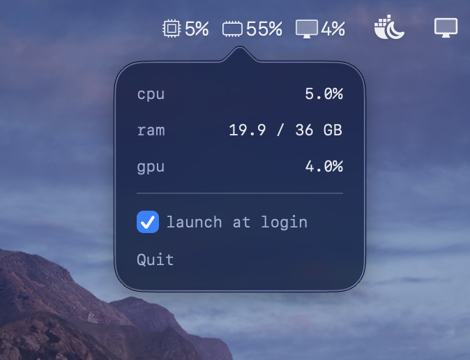

# MiniMonitor
A lightweight macOS menu bar utility to monitor CPU, RAM, and GPU usage in real-time.

## Installation
1. Download the latest release from the [GitHub Releases](https://github.com/daverlon/MiniMonitor/releases) page.
2. Move `MiniMonitor.app` to your Applications folder.
3. Open the app (macOS may warn about an "unidentified developer" — right-click → Open).

## Development
MiniMonitor is written in Swift using SwiftUI and IOKit. The core monitoring logic is in `MiniMonitor.swift`.